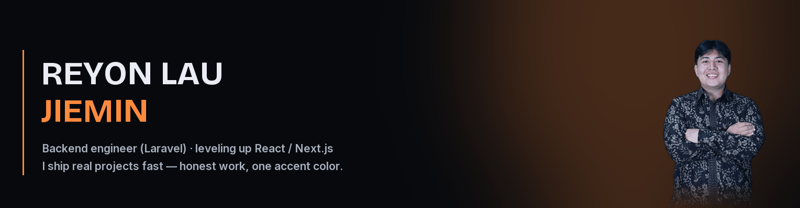

```text
$ whoami
Reyon Lau Jiemin — Informatics Engineering, Universitas Pamulang (class of 07/2026)
$ cat philosophy.txt
Ship real things, fast — but never fake it.
Every number below is pulled live from the GitHub API. No invented stars,
no recycled templates. Junior on purpose, honest by default.
```

### 🛰️ Live stats *(rendered by github-readme-stats, updates itself)*

<a href="https://github.com/Reyonl">
  
</a>
<a href="https://streak-stats.demolab.com/?user=Reyonl">
  
</a>

<br /><br /><br /><br /><br /><br />

### 🔥 Pinned work — real projects, live code

<table>
  <tr>
    <td width="50%">
      <a href="https://github.com/Reyonl/portofolio-v2">
        
      </a>
    </td>
    <td width="50%">
      <a href="https://github.com/Reyonl/project_TA">
        
      </a>
    </td>
  </tr>
  <tr>
    <td>
      <a href="https://github.com/Reyonl/rekapan_bukunota">
        
      </a>
    </td>
    <td>
      <a href="https://github.com/Reyonl/flutter-warungLupi-">
        
      </a>
    </td>
  </tr>
</table>

> **portofolio-v2** — dark, motion-first portfolio (Next.js 16 + Framer Motion + Lenis), Lighthouse 100/100/100 on desktop, built from scratch.
> **project_TA (DAILY.CO)** — Laravel + Livewire order system for a screen-printing business, incl. a Fabric.js mockup editor.
> **rekapan_bukunota / flutter-warungLupi-** — one shop (Warung Lupi), two clients: Laravel web + Flutter Android with Bluetooth thermal printing.

### 🛠️ Stack

Primary — I build production things with these daily:

[](https://www.php.net/) [](https://laravel.com/) [](https://livewire.laravel.com/) [](https://www.mysql.com/) [](https://tailwindcss.com/)

Leveling up in 2026 — learning by shipping, not by tutorial-hoarding:

[](https://react.dev/) [](https://nextjs.org/) [](https://www.typescriptlang.org/) [](https://flutter.dev/) [](https://nodejs.org/)

<details>
<summary>📊 language breakdown (live from my public repos)</summary>
<br/>
<a href="https://github.com/Reyonl">
  
</a>
</details>

### 🧭 How I work

- **AI-assisted, not AI-authored** — I use agentic coding tools daily (~1 year now), but I read, run and break everything they write. The judgment is still mine.
- **Evidence-first** — claims in my portfolio and READMEs must be verifiable. If I can't link it, I don't say it.
- **Consistency > hacks** — contributions graph is a habit, not a sprint (streak card above updates itself; if it's green today, I actually coded today).

### 📫 Reach me

<a href="mailto:liurey55@gmail.com"></a>
<a href="https://github.com/Reyonl"></a>
<a href="https://reyonlau.vercel.app"></a>
<a href="https://www.instagram.com/reyonlau_/"></a>

> ⚡ Open to work — fresh graduate (07/2026), looking for junior backend / full-stack roles (Laravel-first).

<!-- snake, generated nightly by Reyonl/snk — the quiet bitmap of commits -->

